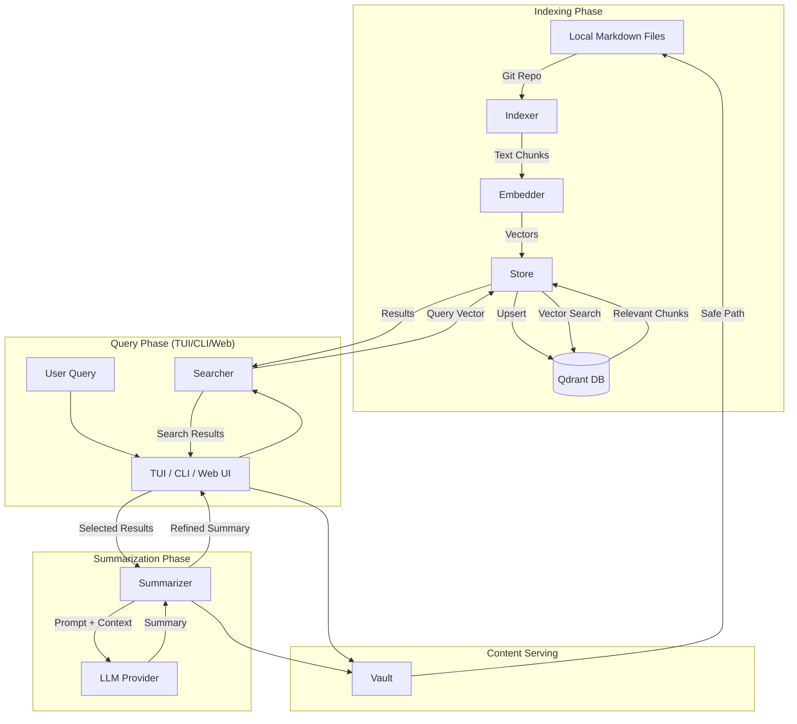

# Architecture of code-gehirn

`code-gehirn` is structured as a modular Go CLI application, leveraging [langchaingo](https://github.com/tmc/langchaingo) for LLM orchestration and vector store integration.

## System Components

### 1. CLI (Cobra)
The entry point of the application, managing subcommands (`index`, `search`, `tui`, `web`) and configuration loading.

### 2. TUI (Bubble Tea)
Provides an interactive search and viewing experience with real-time feedback, markdown rendering via [glamour](https://github.com/charmbracelet/glamour), and LLM-powered summarization.

### 3. Web UI
A browser-based interface that provides search, summarization, and document viewing. It is built with a Go backend and a static frontend embedded using `go:embed`.

### 4. Indexer
Walks a local git repository, identifies markdown files, and uses a `MarkdownTextSplitter` to chunk content while preserving heading context.

### 5. Provider
An abstraction layer built on top of `langchaingo` that handles initialization for various embedding and LLM providers (Ollama, OpenAI, Anthropic, Google AI).

### 6. Store
Manages communication with the Qdrant vector database, including collection creation and similarity search.

### 7. Searcher & Summarizer
Orchestrates semantic search queries and LLM retrieval-augmented generation (RAG) chains. The summarizer can operate in two modes:
- **Chunk-based**: Uses standard RAG chains on vector store chunks.
- **Full-document**: Retrieves matching file paths and reads full documents from the local filesystem for richer context.

### 8. Vault
A security layer that ensures safe file path resolution within the indexed repository, preventing path traversal attacks.

### 9. Runtime
A helper package for initializing and managing the application's core components (Embedder, Store, LLM) based on user configuration.

### 10. Logger
Provides structured logging via `slog`. It includes a custom HTTP transport that intercepts and logs request/response bodies for LLM and vector store calls, facilitating observability and debugging.

## System Data Flow

## Internal Package Structure

- `cmd/`: CLI command definitions (Cobra).
- `internal/config/`: Configuration management (Viper) with home directory resolution.
- `internal/indexer/`: Indexing logic using heading-aware markdown splitting.
- `internal/provider/`: Provider factory for Ollama, OpenAI, Anthropic, and Google AI (Gemini).
- `internal/store/`: Qdrant vector store client and collection management.
- `internal/searcher/`: Semantic search logic and result formatting.
- `internal/summarizer/`: RAG chain orchestration for summarization.
- `internal/tui/`: Interactive terminal UI (Bubble Tea, Lip Gloss, Glamour).
- `internal/web/`: Web server and static frontend assets.
- `internal/vault/`: Safe path resolution logic.
- `internal/runtime/`: Component initialization helpers.
- `internal/logger/`: Structured logging and HTTP traffic interception.
