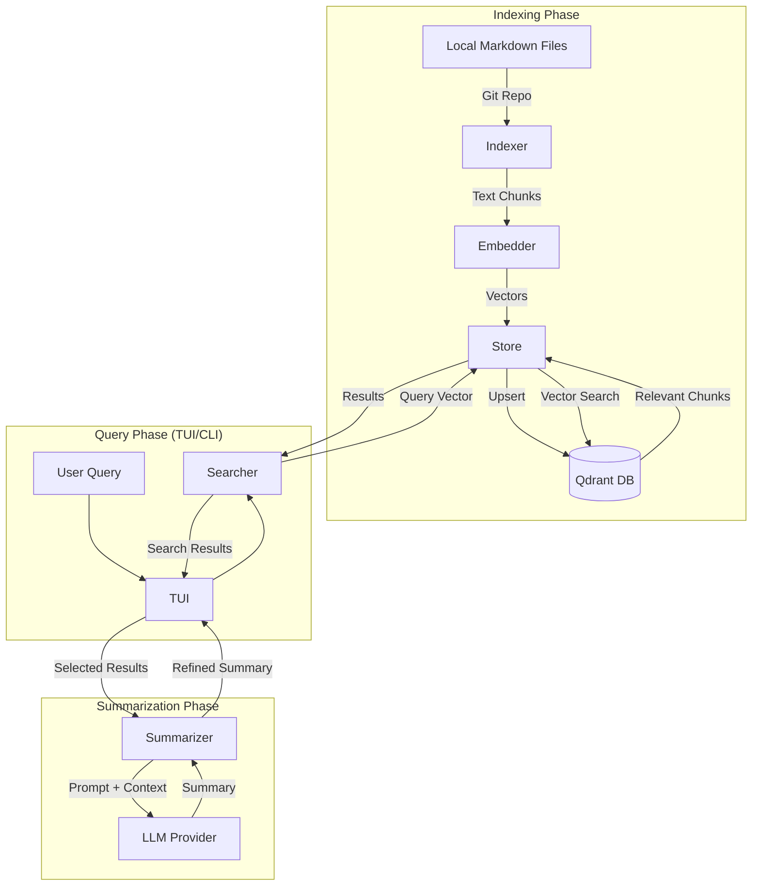

# Architecture of code-gehirn

`code-gehirn` is structured as a modular Go CLI application, leveraging external vector stores and LLM providers for its core intelligence.

## System Components

### 1. CLI (Cobra)
The entry point of the application, managing subcommands and configuration loading.

### 2. TUI (Bubble Tea)
Provides an interactive search and viewing experience.

### 3. Indexer
Reads markdown files from a local git repository, chunks them, and orchestrates their embedding and storage.

### 4. Provider
An abstraction layer for different embedding and LLM providers (e.g., Google Gemini, OpenAI).

### 5. Store
Manages communication with the Qdrant vector database.

### 6. Searcher & Summarizer
The logic for querying the vector store and generating summaries using the LLM.

## System Data Flow

## Internal Package Structure

- `cmd/`: CLI command definitions (Cobra).
- `internal/config/`: Configuration management (Viper).
- `internal/indexer/`: Indexing logic and file parsing.
- `internal/provider/`: Provider implementations (Gemini, Vertex AI).
- `internal/store/`: Vector store client (Qdrant).
- `internal/searcher/`: Semantic search orchestration.
- `internal/summarizer/`: LLM summarization orchestration.
- `internal/tui/`: Interactive terminal UI (Bubble Tea).
