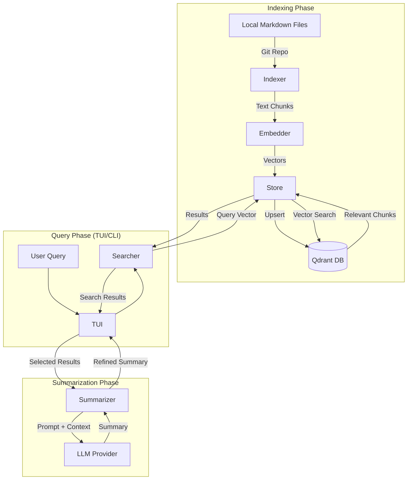

# Architecture of code-gehirn

`code-gehirn` is structured as a modular Go CLI application, leveraging [langchaingo](https://github.com/tmc/langchaingo) for LLM orchestration and vector store integration.

## System Components

### 1. CLI (Cobra)
The entry point of the application, managing subcommands (`index`, `search`, `tui`) and configuration loading.

### 2. TUI (Bubble Tea)
Provides an interactive search and viewing experience with real-time feedback, markdown rendering via [glamour](https://github.com/charmbracelet/glamour), and LLM-powered summarization.

### 3. Indexer
Walks a local git repository, identifies markdown files, and uses a `MarkdownTextSplitter` to chunk content while preserving heading context.

### 4. Provider
An abstraction layer built on top of `langchaingo` that handles initialization for various embedding and LLM providers.

### 5. Store
Manages communication with the Qdrant vector database, including collection creation and similarity search.

### 6. Searcher & Summarizer
Orchestrates semantic search queries and LLM retrieval-augmented generation (RAG) chains to generate context-aware summaries.

## System Data Flow

## Internal Package Structure

- `cmd/`: CLI command definitions (Cobra).
- `internal/config/`: Configuration management (Viper) with home directory resolution.
- `internal/indexer/`: Indexing logic using heading-aware markdown splitting.
- `internal/provider/`: Provider factory for Ollama, OpenAI, Anthropic, and Google AI (Gemini).
- `internal/store/`: Qdrant vector store client and collection management.
- `internal/searcher/`: Semantic search logic and result formatting.
- `internal/summarizer/`: RAG chain orchestration for summarization.
- `internal/tui/`: Interactive terminal UI (Bubble Tea, Lip Gloss, Glamour).
