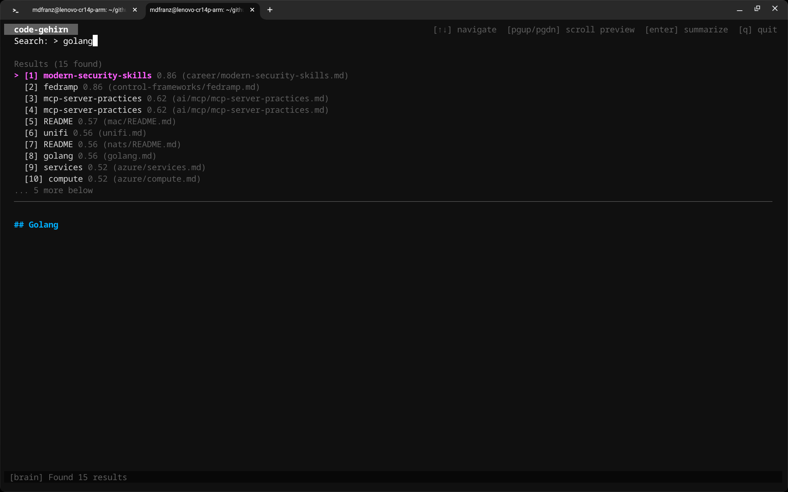
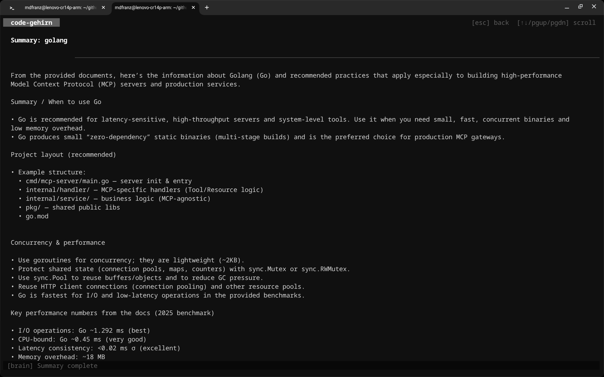
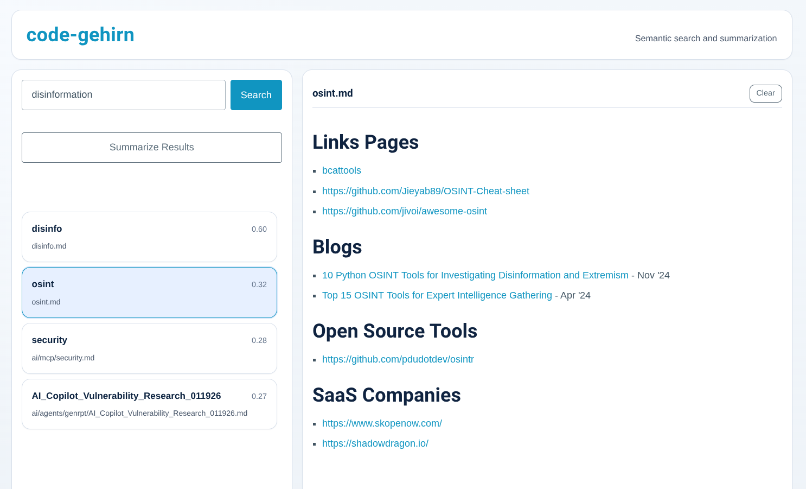
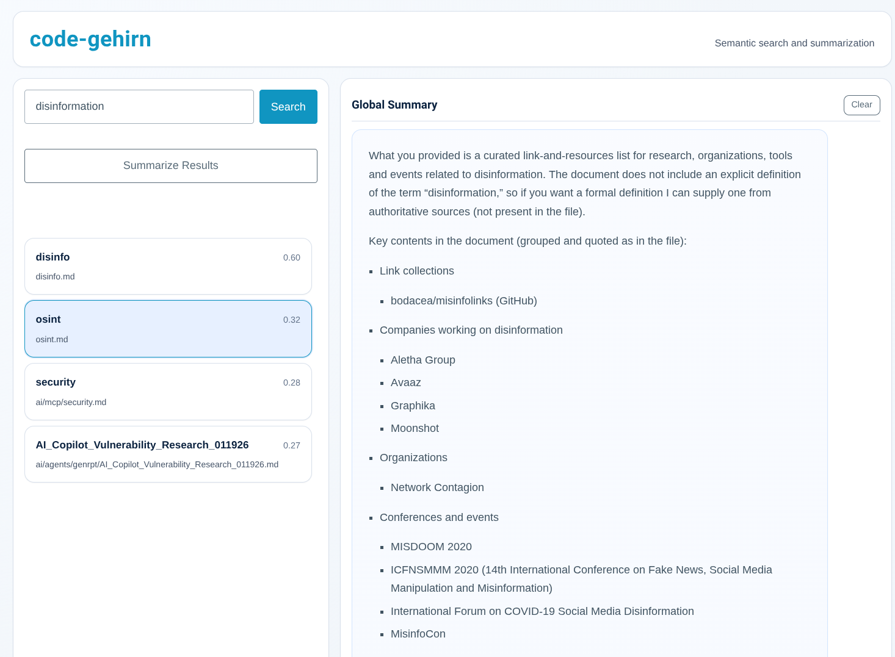

# code-gehirn 🧠

`code-gehirn` (German for "code brain") is a CLI tool for semantic search and summarization of your local markdown knowledge bases (e.g., Obsidian vaults, documentation repositories).

It indexes markdown files from a local repository into a [Qdrant](https://qdrant.tech/) vector database, enabling semantic search and LLM-powered summarization through a modern terminal interface.

## Features

- **Semantic Search**: Find information based on meaning, not just keywords.
- **LLM Summarization**: Get concise summaries of search results using various LLM providers.
- **Interactive TUI**: A beautiful terminal user interface built with [Bubble Tea](https://github.com/charmbracelet/bubbletea).
- **Markdown Preview**: Rich markdown rendering in the TUI using [Glamour](https://github.com/charmbracelet/glamour).
- **Git Integration**: Indexes markdown files directly from local repositories, skipping internal git data.
- **Multi-Provider Support**: Supports multiple embedding and LLM providers including Ollama (local), OpenAI, Anthropic, and Google Gemini.

## Interfaces

### Search
```
mdfranz@lenovo-cr14p-arm:~/github/cheetsheetz$ ~/bin/code-gehirn search "agno"
[1] README (score: 0.655)
    ## Agno - [agno](./agno.md)

[2] README (score: 0.655)
    ## Agno - [agno](./agno.md)

[3] agno (score: 0.607)
    # Docs - [agno](https://github.com/agno-agi/agno)

[4] agno (score: 0.607)
    # Docs - [agno](https://github.com/agno-agi/agno)

[5] agno (score: 0.412)
    # Skills - [https://github.com/agno-agi/agno-skills](https://github.com/agno-agi/agno-skills) - [https://github.com/Ash-Blanc/skill-optimizer](https://github.com/Ash-Blanc/skill-optimizer) - [https://...

[6] agno (score: 0.412)
    # Skills - [https://github.com/agno-agi/agno-skills](https://github.com/agno-agi/agno-skills) - [https://github.com/Ash-Blanc/skill-optimizer](https://github.com/Ash-Blanc/skill-optimizer) - [https://...

[7] agno (score: 0.357)
    # Articles - [https://medium.com/ai-agent-insider/agno-building-multimodal-ai-agents-48571b835a93](https://medium.com/ai-agent-insider/agno-building-multimodal-ai-agents-48571b835a93))

[8] agno (score: 0.357)
    # Articles - [https://medium.com/ai-agent-insider/agno-building-multimodal-ai-agents-48571b835a93](https://medium.com/ai-agent-insider/agno-building-multimodal-ai-agents-48571b835a93))
```

### TUI




### Web





## Prerequisites

- **Go**: 1.26 or higher.
- **Qdrant**: A running instance of Qdrant (local Docker container or Qdrant Cloud).
- **API Keys**: Access to an embedding model and an LLM (unless using Ollama).

## Installation

1. Clone the repository:
   ```bash
   git clone https://github.com/mfranz/code-gehirn.git
   cd code-gehirn
   ```

2. Build the binary:
   ```bash
   make build
   ```

3. (Optional) Install the binary to `~/bin`:
   ```bash
   make install
   ```

## Configuration

`code-gehirn` looks for a configuration file at `~/.config/code-gehirn/config.yaml` or `./config.yaml`.

### Using Ollama (Local)

To use Ollama for both embeddings and LLM tasks, ensure your Ollama server is running (default port `11434`) and has the required models pulled:

```bash
ollama pull llama3
ollama pull nomic-embed-text
```

#### Via Environment Variables
Environment variables take precedence over the configuration file. This is useful for quick testing:

```bash
# Ollama Endpoint
export GEHIRN_LLM_BASE_URL=http://localhost:11434
export GEHIRN_EMBEDDING_BASE_URL=http://localhost:11434

# Providers and Models
export GEHIRN_LLM_PROVIDER=ollama
export GEHIRN_LLM_MODEL=llama3
export GEHIRN_EMBEDDING_PROVIDER=ollama
export GEHIRN_EMBEDDING_MODEL=nomic-embed-text

# Optional: Override the default collection name. 
# By default, code-gehirn uses: code-gehirn-<hostname>-<os>-<model-shortname>-<shorthash>
# export GEHIRN_QDRANT_COLLECTION=code-gehirn-ollama
```

#### Via config.yaml
Update your `config.yaml` with the following:

```yaml
qdrant:
  url: "http://localhost:6333"
  # collection: "code-gehirn-ollama" (optional, defaults to code-gehirn-hostname-os-shortname-shorthash)

llm:
  provider: "ollama"
  model: "llama3"
  base_url: "http://localhost:11434"

embedding:
  provider: "ollama"
  model: "nomic-embed-text"
  base_url: "http://localhost:11434"
```

> **Note:** Different embedding models (e.g., OpenAI vs. Ollama) produce different vector dimensions. `code-gehirn` automatically appends the model's shortname and a short hash of the full model name to its default collection name to prevent dimension mismatch errors. If you manually set a collection name, you are responsible for ensuring it matches the model's dimensions.

### Full Environment Variable Reference

All configuration values can be overridden using environment variables prefixed with `GEHIRN_`.

| Component | Environment Variable | Description |
| :--- | :--- | :--- |
| **Qdrant** | `GEHIRN_QDRANT_URL` | URL of your Qdrant instance (default: `http://localhost:6333`) |
| | `GEHIRN_QDRANT_COLLECTION` | The name of the collection to use |
| | `GEHIRN_QDRANT_API_KEY` | Optional API key for Qdrant Cloud |
| **LLM** | `GEHIRN_LLM_PROVIDER` | LLM provider: `ollama`, `openai`, `anthropic`, or `googleai` |
| | `GEHIRN_LLM_MODEL` | The specific model name (e.g., `llama3`, `gpt-5-mini`) |
| | `GEHIRN_LLM_BASE_URL` | Optional override for the LLM API endpoint |
| | `GEHIRN_LLM_API_KEY` | API key for OpenAI, Anthropic, or Google Gemini |
| | `GEHIRN_LLM_MAX_TOKENS`| Maximum tokens for LLM generation (default: `16384`) |
| **Embedding**| `GEHIRN_EMBEDDING_PROVIDER`| Embedding provider: `ollama` or `openai` |
| | `GEHIRN_EMBEDDING_MODEL` | Embedding model (e.g., `nomic-embed-text`, `text-embedding-3-small`) |
| | `GEHIRN_EMBEDDING_BASE_URL`| Optional override for the Embedding API endpoint |
| | `GEHIRN_EMBEDDING_API_KEY`| API key for OpenAI embeddings |
| **Search** | `GEHIRN_SEARCH_MIN_SCORE` | Minimum similarity score (0.0–1.0) |
| | `GEHIRN_SEARCH_MAX_RESULTS`| Number of results to return |
| **Summary** | `GEHIRN_SUMMARY_TOP_K` | Number of documents to use for summarization |
| **Logs** | `GEHIRN_LOG_API_FILE` | Path to log HTTP/LLM/Qdrant traffic |
| | `GEHIRN_LOG_APP_FILE` | Path to log application events and errors |
| **Vault** | `GEHIRN_VAULT_PATH` | The local path to your knowledge base (default: current directory) |

### Custom Configuration File
You can also specify a custom configuration file using the global `--config` flag:
```bash
./code-gehirn --config /path/to/config.yaml tui
```

## Usage

### 1. Indexing
Index your markdown files into Qdrant:
```bash
./code-gehirn index /path/to/your/markdown/repo
```

### 2. Semantic Search (CLI)
Perform a quick search from the command line:
```bash
./code-gehirn search "How do I configure the database?"
```

Available flags for `search`:
- `-n`, `--top`: Number of results to return (default: 5).
- `-t`, `--threshold`: Minimum similarity score (0.0–1.0) (default: 0.0).
- `--urls`: Output only extracted URLs from the search results.
- `--all`: When used with `--urls`, extract all URLs from the full source file instead of just the relevant chunk.
- `--config`: (Global) Path to a specific configuration file.

### 3. LLM Summarization (CLI)
Generate a summary of search results:
```bash
./code-gehirn summarize "Summarize recent project updates"
```

Available flags for `summarize`:
- `-k`, `--top`: Number of documents to use for summarization (default: 5).
- `-m`, `--tokens`: Maximum tokens to generate (default: 16384).

### 4. Interactive TUI
Launch the full interactive experience:
```bash
./code-gehirn tui
```
In the TUI:
- **Search**: Type to search with real-time feedback.
- **Navigate**: Use arrow keys to navigate results.
- **Preview**: View rendered markdown on the right/bottom as you navigate.
- **Summarize**: Press `Enter` to generate an LLM summary of the search results.
- **Quit**: Press `q` or `Ctrl+C` to exit.

### 5. Web UI
Launch the experimental web interface:
```bash
./code-gehirn web
```
The web UI is available at `http://localhost:8080` by default. You can change the port with the `-p` or `--port` flag.

## License

[MIT](LICENSE)
