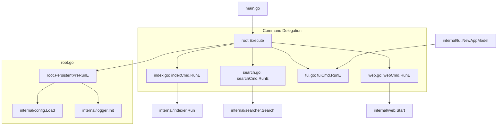

# Command Implementation (`cmd/`)

This directory implements the CLI entry points and command orchestration for `code-gehirn`. It uses the [Cobra](https://github.com/spf13/cobra) library to define a hierarchical command structure.

## Key Features (Commands)

- **Root (`root.go`)**: The main entry point. Handles global configuration loading via `Viper`, initializes application logging, and manages the persistent pre-run logic for all subcommands.
- **Index (`index.go`)**: Implements the `index <path>` command. Orchestrates the process of probing embedding dimensions, ensuring the Qdrant collection exists, and invoking the `indexer` to process a repository.
- **Search (`search.go`)**: Implements the `search <query>` command. Provides a non-interactive semantic search interface with support for similarity thresholds and a specialized `--urls` extraction mode.
- **TUI (`tui.go`)**: Implements the `tui` command. Initializes the `bubbletea` program and handles the redirection of `stderr` to ensure the terminal UI remains uncorrupted by provider SDK logs.
- **Web (`web.go`)**: Implements the `web` command. Bootstraps the HTTP server, initializes the necessary LLM and Vector Store providers, and starts the web-based user interface.

## Code Flow Diagram

This diagram shows the command delegation and initialization flow within this directory:

## Key APIs and SDKs

The implementation in this directory depends on the following external and internal interfaces:

### External CLI Libraries
- **`github.com/spf13/cobra`**: Used for command definition, argument validation, and CLI lifecycle management.
- **`github.com/spf13/viper`**: Used for hierarchical configuration management (file, environment, defaults).

### Internal Orchestration Points
- **`internal/config`**: Configuration schema and loading logic.
- **`internal/runtime`**: Factory methods for initializing LLM and Vector Store providers.
- **`internal/logger`**: Centralized logging for both application logic and provider API interactions.
- **`internal/indexer`**, **`internal/searcher`**, **`internal/tui`**, **`internal/web`**: The functional implementations that each command delegates to.
