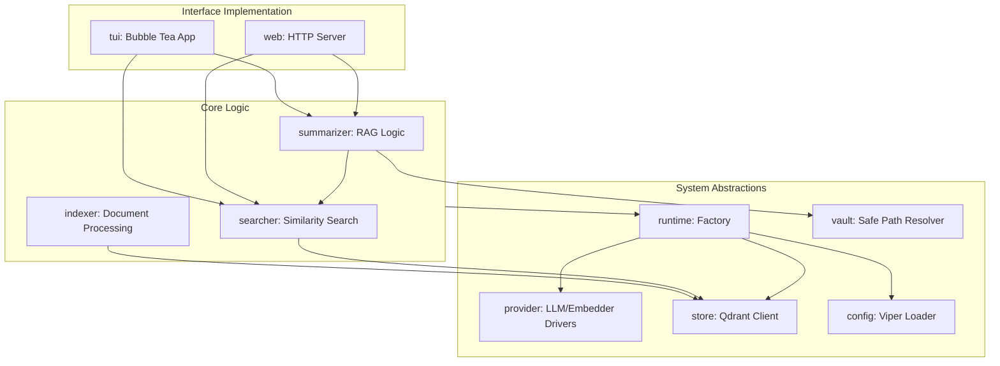

# Internal Implementation (`internal/`)

This directory contains the core business logic, provider abstractions, and data processing pipelines for `code-gehirn`. It is designed to be modular, with each sub-package handling a specific domain of the application.

## Key Features

- **Configuration Management (`config/`)**: Centralized schema and loading logic using Viper, supporting YAML files and environment variables.
- **Provider Abstraction (`provider/` & `runtime/`)**: A factory-based system to instantiate LLM and Embedding clients (OpenAI, Anthropic, Ollama, Google AI) through a unified interface.
- **Content Processing (`indexer/`)**: Handles repository crawling, Markdown-specific text splitting (preserving heading context), and metadata enrichment.
- **Vector Search (`store/` & `searcher/`)**: High-level wrappers around Qdrant for collection management and similarity search.
- **Augmented Summarization (`summarizer/`)**: Implements two strategies for LLM-powered answers:
    - **Chunk-based**: Uses standard RetrievalQA chains.
    - **Full-file**: Reconstructs complete relevant documents from the local "vault" to provide broader context to the LLM.
- **Interactive TUI (`tui/`)**: A complete Bubble Tea application implementing the Elm architecture, managing asynchronous initialization, search states, and streaming summaries.
- **Web Backend (`web/`)**: A lightweight HTTP server and API that mirrors the CLI's search and summarization capabilities for the browser.
- **Security & Safety (`vault/`)**: Path resolution utilities that prevent directory traversal when reading files from the local knowledge base.

## Code Flow Diagram

The following diagram illustrates the internal data flow and package dependencies:

## Key APIs and SDKs

### Core Framework
- **`github.com/tmc/langchaingo`**: The primary SDK for LLM orchestration.
    - `chains`: Used for RetrievalQA and document summarization.
    - `vectorstores`: Provides the abstraction for Qdrant.
    - `llms` & `embeddings`: Unified interfaces for AI providers.
    - `textsplitter`: Used for Markdown-aware document chunking.

### Terminal UI
- **`github.com/charmbracelet/bubbletea`**: The core TUI framework.
- **`github.com/charmbracelet/bubbles`**: UI components (Viewport, TextInput, Spinner).
- **`github.com/charmbracelet/lipgloss`**: Styling and layout primitives.

### Infrastructure & Utilities
- **`github.com/spf13/viper`**: Configuration management.
- **`log/slog`**: Structured logging used throughout all internal packages.
- **`net/http`**: Standard library used for both the Web UI and direct Qdrant REST API calls (e.g., collection management).
- **`path/filepath`**: Extensively used in `indexer` and `vault` for safe file system operations.
